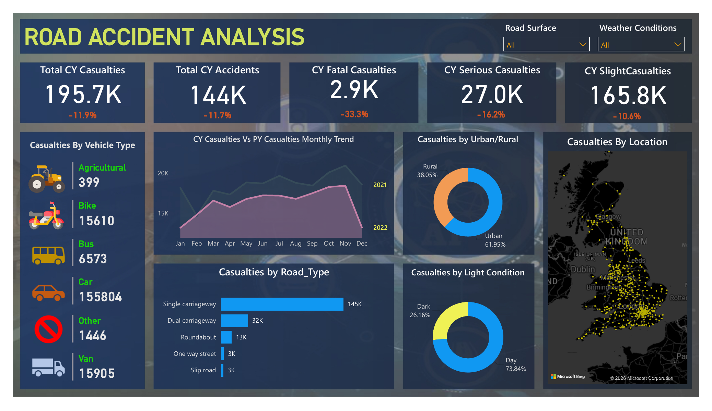

# 🚧 Road Accident Analysis Dashboard (UK, 2021–2022)

An interactive Power BI dashboard analyzing **307,973 road accident records** from the UK (2021–2022), built to surface casualty trends by severity, vehicle type, location, and road/weather conditions for data-driven road safety insight.

## 📌 Key Insights

- **195.7K total casualties** across **144K accidents** in the current year (↓11.9% and ↓11.7% YoY respectively)
- **2.9K fatal**, **27.0K serious**, and **165.8K slight** casualties — fatal casualties dropped the most YoY (↓33.3%)
- **Cars accounted for 155,804 casualties** — by far the highest of any vehicle type, followed by vans (15,905) and bikes (15,610)
- **Single carriageways** are the highest-risk road type, linked to **145K casualties** — over 4x the next closest category (dual carriageways, 32K)
- **61.95% of casualties occurred in urban areas** vs. 38.05% in rural areas
- **73.84% of casualties happened in daylight**, with the remaining 26.16% occurring in dark conditions
- Interactive **Road Surface** and **Weather Conditions** filters, plus a **geographic map view**, allow drill-down into location-specific casualty patterns

## 🛠️ Tools & Techniques

- **Power BI Desktop** — dashboard design, DAX measures, data modeling
- **Data Modeling** — relationships between accident, casualty, and vehicle-level records
- **DAX** — YoY % change calculations, dynamic KPI cards
- Interactive slicers, donut charts, bar charts, trend lines, and Bing map visualization

## 📂 Repository Contents

| File | Description |
|---|---|
| `Power_bi_Accident_report.pbix` | Power BI Desktop project file (open in Power BI Desktop) |
| `Power_bi_Accident_report.pdf` | Static export of the dashboard |
| `dashboard-overview.png` | Dashboard preview image (shown above) |

## ▶️ How to View

1. Download `Power_bi_Accident_report.pbix`
2. Open it in [Power BI Desktop](https://powerbi.microsoft.com/desktop/) (free)
3. Interact with the Road Surface / Weather Conditions slicers and map to explore the data

---

**Author:** Mayank Panwar
📧 mayankpanwar15376@gmail.com | 🔗 [LinkedIn](https://linkedin.com/in/mayank-panwar) | 💻 [GitHub](https://github.com/mayankpanwar15376-tech)
